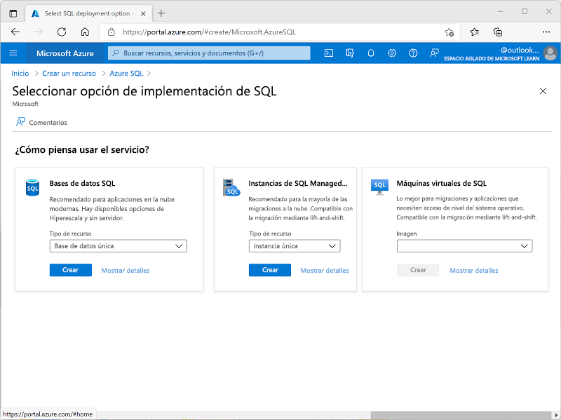
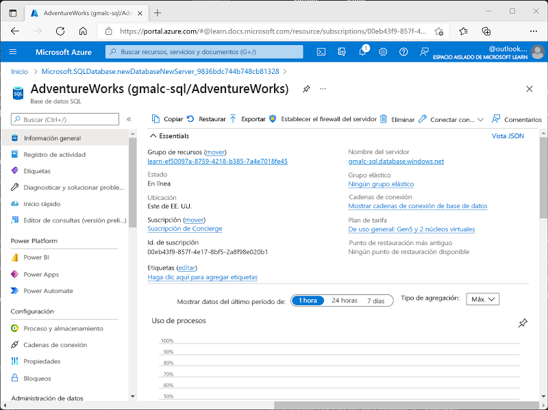
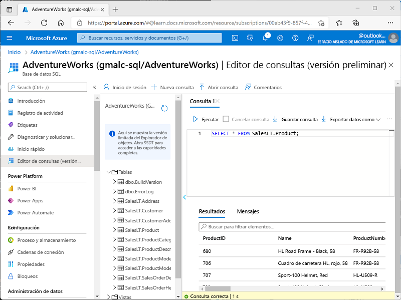

---
lab:
  title: Exploración de Azure SQL Database
  module: Explore relational data in Azure
---

# Exploración de Azure SQL Database

En este ejercicio, aprovisionará un recurso de Azure SQL Database en la suscripción de Azure y, a continuación, usará SQL para consultar las tablas de una base de datos relacional.

Este laboratorio se tarda aproximadamente **15** minutos en completarse.

## Antes de empezar

Necesitará una [suscripción de Azure](https://azure.microsoft.com/free) en la que tenga acceso de nivel administrativo.

## Aprovisionamiento de un recurso de Azure SQL Database

1. En [Azure Portal](https://portal.azure.com?azure-portal=true), selecciona **&#65291; Crear un recurso** en la esquina superior izquierda y busca `Azure SQL`. En la página de **Azure SQL** que aparece, seleccione **Crear**.

1. Revise las opciones de Azure SQL disponibles y, luego, en el icono **Bases de datos SQL**, asegúrese de que está seleccionado **Base de datos única** y seleccione **Crear**.

    

1. Escriba los valores siguientes en la página **Crear base de datos SQL** y deje todas las demás propiedades con su configuración predeterminada:
    - **Suscripción**: Seleccione su suscripción a Azure.
    - **Grupo de recursos**: cree un grupo de recursos con el nombre que prefiera.
    - **Nombre de base de datos**: `AdventureWorks`
    - **Servidor**: seleccione **Crear nuevo** y cree un servidor con un nombre único en cualquier ubicación disponible. Use la **autenticación de SQL** y especifique su nombre como inicio de sesión de administrador del servidor y una contraseña con una complejidad adecuada (anote la contraseña, ya que la necesitará más adelante).
    - **¿Quiere usar un grupo elástico de SQL?**: *No*.
    - **Entorno de la carga de trabajo**: desarrollo
    - **Proceso y almacenamiento**: no lo cambie.
    - **Redundancia de almacenamiento de Backup**: seleccione *Locally-redundant backup storage* (Almacenamiento de copia de seguridad con redundancia local).

1. En la página **Crear base de datos SQL**, seleccione **Siguiente: Redes >** y, en la página **Redes**, en la sección **Conectividad de red**, seleccione **Punto de conexión público**. Seleccione **Sí** para ambas opciones de la sección **Reglas de firewall** a fin de permitir el acceso al servidor de bases de datos desde los servicios de Azure y la dirección IP del cliente actual.

1. Seleccione **Siguiente: Seguridad >** y establezca la opción **Enable Microsoft Defender for SQL** (Habilitar Microsoft Defender para SQL) en **Ahora no**.

1. Seleccione **Siguiente: Configuración adicional >** y, en la pestaña **Configuración adicional**, establezca la opción **Usar datos existentes** en **Ejemplo** (esto creará una base de datos de ejemplo que puede explorar más adelante).

1. Seleccione **Revisar y crear** y, luego, **Crear** para crear la base de datos de Azure SQL.

1. Espere a que la implementación finalice. Después, vaya al recurso que se ha implementado, que debería tener este aspecto:

    

1. En el panel del lado izquierdo de la página, seleccione **Editor de consultas (versión preliminar)** e inicie sesión con el inicio de sesión de administrador y la contraseña que especificó para el servidor.
    
    >**Nota**: si se muestra un mensaje de error que indica que no se permite la dirección IP del cliente, selecciona el vínculo **Lista de direcciones IP permitidas…** al final del mensaje para permitir el acceso e intenta iniciar sesión de nuevo (antes agregaste la dirección IP de cliente de tu propio equipo a las reglas de firewall, pero el editor de consultas podría conectarse desde otra dirección, en función de la configuración de red).
    
    El editor de consultas tiene el aspecto siguiente:
    
    

1. Expanda la carpeta **Tablas** para ver las tablas de la base de datos.

1. En el panel **Consulta 1**, escriba el siguiente código SQL:

    ```sql
   SELECT * FROM SalesLT.Product;
    ```

1. Seleccione **&#9655; Ejecutar** encima de la consulta para ejecutarla y ver los resultados, que deberían incluir todas las columnas de todas las filas de la tabla **SalesLT.Product**, tal como se muestra aquí:

    

1. Reemplace la instrucción SELECT por el código siguiente y, luego, seleccione **&#9655; Ejecutar** para ejecutar la nueva consulta y revisar los resultados (se incluyen solo las columnas **ProductID**, **Name**, **ListPrice** y **ProductCategoryID**):

    ```sql
   SELECT ProductID, Name, ListPrice, ProductCategoryID
   FROM SalesLT.Product;
    ```

1. Ahora pruebe la consulta siguiente, que usa JOIN para obtener el nombre de categoría de la tabla **SalesLT.ProductCategory**:

    ```sql
   SELECT p.ProductID, p.Name AS ProductName,
           c.Name AS Category, p.ListPrice
   FROM SalesLT.Product AS p
   JOIN [SalesLT].[ProductCategory] AS c
       ON p.ProductCategoryID = c.ProductCategoryID;
    ```

1. Cierre el panel del editor de consultas y descarte las modificaciones.

> **Sugerencia**: Si ha terminado de explorar Azure SQL Database, puede eliminar el grupo de recursos que creó en este ejercicio.
