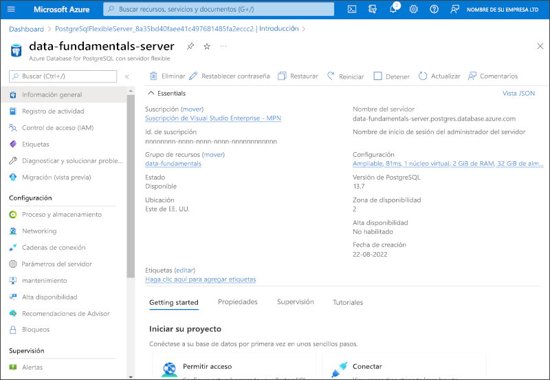

---
lab:
  title: Exploración de Azure Database for PostgreSQL
  module: Explore relational data in Azure
---

# Exploración de Azure Database for PostgreSQL

En este ejercicio, aprovisionará un recurso de Azure Database for PostgreSQL en su suscripción de Azure.

Este laboratorio se tarda aproximadamente **5** minutos en completarse.

## Antes de empezar

Necesitará una [suscripción de Azure](https://azure.microsoft.com/free) en la que tenga acceso de nivel administrativo.

## Aprovisionamiento de un recurso de Azure Database for PostgreSQL

En este ejercicio, aprovisionará un recurso de Azure Database for PostgreSQL.

1. En Azure Portal, seleccione **&#65291; Crear un recurso** en la esquina superior izquierda y busque *Azure Database for PostgreSQL*. En la página **Azure Database for PostgreSQL** que aparece, seleccione **Crear**.

1. Revise las opciones de Azure Database for PostgreSQL que están disponibles y luego, en el icono **Servidor flexible**, seleccione **Crear**.

    

1. Escriba los valores siguientes en la página **Crear base de datos SQL**:
    - **Suscripción**: Seleccione su suscripción a Azure.
    - **Grupo de recursos**: cree un grupo de recursos con el nombre que prefiera.
    - **Nombre del servidor**: escriba un nombre único.
    - **Región**: seleccione una región cercana.
    - **Versión de PostgreSQL**: no lo cambie.
    - **Tipo de carga de trabajo**: seleccione **Desarrollo**.
    - **Proceso y almacenamiento**: no lo cambie.
    - **Zona de disponibilidad**: no lo cambie.
    - **Habilitar alta disponibilidad**: no lo cambie.
    - **Nombre de usuario de administrador**: indique su nombre.
    - **Contraseña** y **Confirmar contraseña**: especifique una contraseña con una complejidad adecuada.

1. Seleccione **Siguiente: Redes**.

1. En **Reglas de firewall**, seleccione **&#65291; Agregar dirección IP del cliente actual**.

1. Seleccione **Revisar y crear** y, luego, **Crear** para crear la base de datos de Azure PostgreSQL.

1. Espere a que la implementación finalice. Después, vaya al recurso que se ha implementado, que debería tener este aspecto:

    

1. Revise las opciones para administrar el recurso de Azure Database for PostgreSQL.

> **Sugerencia**: Si ha terminado de explorar Azure Database for PostgreSQL, puede eliminar el grupo de recursos que creó en este ejercicio.
