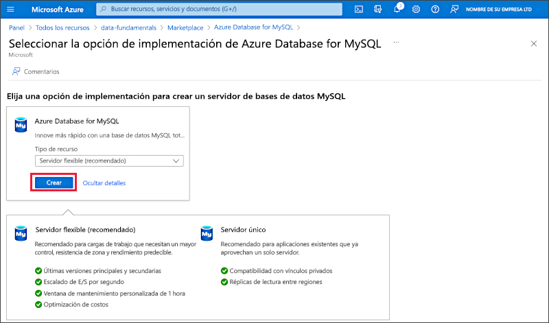
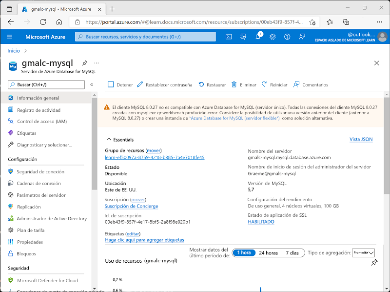

---
lab:
  title: Exploración de Azure Database for MySQL
  module: Explore relational data in Azure
---

# Exploración de Azure Database for MySQL

En este ejercicio, aprovisionará un recurso de Azure Database for MySQL en su suscripción de Azure.

Este laboratorio se tarda aproximadamente **5** minutos en completarse.

## Antes de empezar

Necesitará una [suscripción de Azure](https://azure.microsoft.com/free) en la que tenga acceso de nivel administrativo.

## Aprovisionamiento de un recurso de Azure Database for MySQL

En este ejercicio, aprovisionará un recurso de Azure Database for MySQL.

1. In the Azure portal, select <bpt id="p1">**</bpt>&amp;#65291; Create a resource<ept id="p1">**</ept> from the upper left-hand corner and search for <bpt id="p2">*</bpt>Azure Database for MySQL<ept id="p2">*</ept>. Then in the resulting <bpt id="p1">**</bpt>Azure Database for MySQL<ept id="p1">**</ept> page, select <bpt id="p2">**</bpt>Create<ept id="p2">**</ept>.

1. Review the Azure Database for MySQL options that are available. Then for <bpt id="p1">**</bpt>Resource type<ept id="p1">**</ept>, select <bpt id="p2">**</bpt>Flexible Server<ept id="p2">**</ept> and select <bpt id="p3">**</bpt>Create<ept id="p3">**</ept>.

    

1. Escriba los valores siguientes en la página **Crear base de datos SQL**:
    - **Suscripción**: Seleccione su suscripción a Azure.
    - **Grupo de recursos**: cree un grupo de recursos con el nombre que prefiera.
    - **Nombre del servidor**: escriba un nombre único.
    - **Región**: cualquier ubicación disponible cercana.
    - **Versión de MySQL**: no lo cambie.
    - **Tipo de carga de trabajo**: para proyectos de desarrollo o aficiones.
    - **Proceso y almacenamiento**: no lo cambie.
    - **Zona de disponibilidad**: no lo cambie.
    - **Habilitar alta disponibilidad**: no lo cambie.
    - **Nombre de usuario de administrador**: indique su nombre.
    - **Contraseña** y **Confirmar contraseña**: especifique una contraseña con una complejidad adecuada.

1. Seleccione **Siguiente: Redes**.

1. En **Reglas de firewall**, seleccione **&#65291; Agregar dirección IP del cliente actual**.

1. Seleccione **Revisar y crear** y, luego, **Crear** para crear la base de datos de Azure MySQL.

1. Wait for deployment to complete. Then go to the resource that was deployed, which should look like this:

    

1. Revise las opciones para administrar el recurso de Azure Database for MySQL.

> **Sugerencia**: Si ha terminado de explorar Azure Database for MySQL, puede eliminar el grupo de recursos que creó en este ejercicio.
