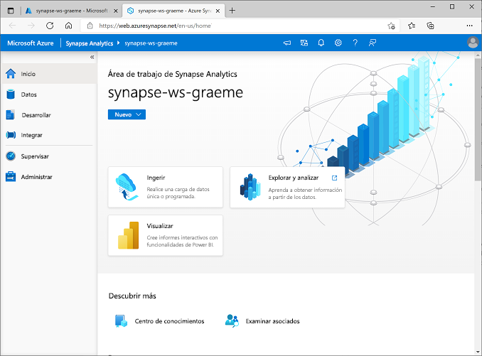
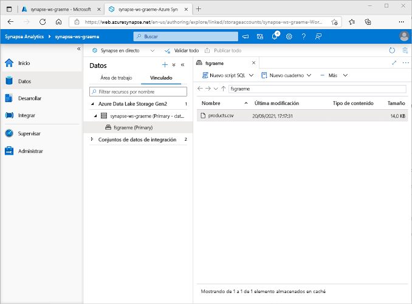
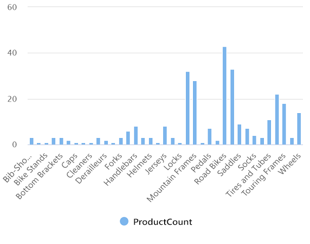
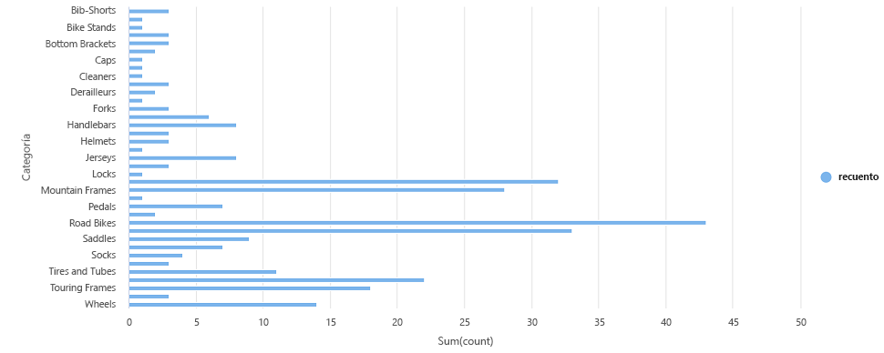

---
lab:
  title: Exploración del análisis de datos en Azure con Azure Synapse Analytics
  module: Explore fundamentals of large-scale data warehousing
---

# <a name="explore-data-analytics-in-azure-with-azure-synapse-analytics"></a>Exploración del análisis de datos en Azure con Azure Synapse Analytics

En este ejercicio aprovisionará un área de trabajo de Azure Synapse Analytics en su suscripción de Azure y lo usará para ingerir y consultar datos.

Este laboratorio se tarda aproximadamente **30** minutos en completarse.

## <a name="before-you-start"></a>Antes de empezar

Necesitará una [suscripción de Azure](https://azure.microsoft.com/free) en la que tenga acceso de nivel administrativo.

## <a name="provision-an-azure-synapse-analytics-workspace"></a>Aprovisionar un área de trabajo de Azure Synapse Analytics

Para usar Azure Synapse Analytics, debe aprovisionar un recurso en el área de trabajo de Azure Synapse Analytics en la suscripción de Azure.

1. Abra Azure Portal en [https://portal.azure.com](https://portal.azure.com?azure-portal=true) e inicie sesión con las credenciales asociadas con su suscripción de Azure.

    >                 **Sugerencia**: Asegúrese de que está trabajando en el directorio que contiene la suscripción, lo que se indica en la parte superior derecha, debajo del identificador de usuario. Si no es así, seleccione el icono de usuario y cambie el directorio.

2. En la página **Inicio** de Azure Portal, use el icono **&#65291; Crear un recurso** para crear un recurso.
3. Busque *Azure Synapse Analytics*, y cree un recurso de **Azure Synapse Analytics** con la siguiente configuración:
    - **Suscripción**: *suscripción de Azure*
        - **Grupo de recursos**: *cree un grupo de recursos con un nombre apropiado, como "synapse-rg"*.
        - **Grupo de recursos administrado**: *escriba un nombre adecuado, por ejemplo, "synapse-managed-rg"*.
    - **Nombre del área de trabajo**: *escriba un nombre único para el área de trabajo, por ejemplo, "synapse-ws-<su_nombre>"* .
    - **Región**: *seleccione cualquiera de las siguientes regiones:*
        - Este de Australia
        - Centro de EE. UU.
        - Este de EE. UU. 2
        - Norte de Europa
        - Centro-sur de EE. UU.
        - Sudeste de Asia
        - Sur de Reino Unido 2
        - Oeste de Europa
        - Oeste de EE. UU.
        - WestUS 2
    - **Seleccionar Data Lake Storage Gen 2**: en la suscripción.
        - **Nombre de cuenta**: *cree una cuenta con un nombre único, por ejemplo, "datalake<your_name>"*.
        - **Nombre del sistema de archivos**: *cree un sistema de archivos con un nombre único, por ejemplo, "fs<your_name>"*.

    >                 **Nota**: Un área de trabajo de Synapse Analytics requiere dos grupos de recursos en la suscripción de Azure; uno para los recursos creados explícitamente y otro para los recursos administrados que utiliza el servicio. También requiere una cuenta de almacenamiento de Data Lake en la que almacenar datos, scripts y otros artefactos.

4. Cuando haya especificado estos detalles, seleccione **Revisar y crear** y, a continuación, seleccione **Crear** para crear el área de trabajo.
5. Espere a que se cree el área de trabajo; puede tardar unos cinco minutos.
6. Una vez completada la implementación, vaya al grupo de recursos que se creó y observe que contiene el área de trabajo de Synapse Analytics y una cuenta de almacenamiento de Data Lake.
7. Seleccione el área de trabajo de Synapse y, en su página **Información general**, en la tarjeta **Abrir Synapse Studio**, seleccione **Abrir** para abrir Synapse Studio en una nueva pestaña del explorador. Synapse Studio es una interfaz basada en web que puede usar para trabajar con el área de trabajo de Synapse Analytics.
8. En el lado izquierdo de Synapse Studio, use el icono **&rsaquo;&rsaquo;** para expandir el menú; esto muestra las distintas páginas de Synapse Studio que usará para administrar recursos y realizar tareas de análisis de datos, como se muestra aquí:

    

## <a name="ingest-data"></a>Ingerir datos

Una de las tareas clave que puede realizar con Azure Synapse Analytics es definir *canalizaciones* que transfieran (y, si es necesario, transformen) datos de una amplia variedad de orígenes al área de trabajo para su análisis.

1. En la página **Inicio** de Synapse Studio, seleccione **Ingerir** para abrir la herramienta **Copiar datos**.
2. En la herramienta Copiar datos, en el paso **Propiedades**, asegúrese de que las opciones **Built-in copy task** (Tarea de copia integrada) y **Run once now** (Ejecutar una vez ahora) están seleccionadas y haga clic en **Siguiente >**.
3. En el paso **Origen**, en el subpaso **Conjunto de datos**, seleccione la siguiente configuración:
    - **Tipo de origen**: todos
    - **Conexión**: *cree una conexión y, en el panel **Nueva conexión** que aparece, en la pestaña **Archivo**, seleccione **HTTP**. Después, continúe y cree una conexión a un archivo de datos mediante la siguiente configuración:*
        - **Nombre**: productos de AdventureWorks
        - **Descripción**: lista de productos a través de HTTP
        - **Conectar mediante Integration Runtime**: AutoResolveIntegrationRuntime
        - **Dirección URL base**: `https://raw.githubusercontent.com/MicrosoftLearning/DP-900T00A-Azure-Data-Fundamentals/master/Azure-Synapse/products.csv`
        - **Validación del certificado de servidor**: habilitar
        - **Tipo de autenticación**: anónimo
4. Después de crear la conexión, en el subpaso **Origen/Conjunto de datos**, asegúrese de que está seleccionada la siguiente configuración y, a continuación, seleccione **Siguiente >**:
    - **Dirección URL relativa**: *dejar en blanco*
    - **Request method** (Método de solicitud): GET
    - **Encabezados adicionales**: *dejar en blanco*
    - **Copia binaria**: <u>sin</u> seleccionar
    - **Tiempo de espera de solicitud**: *dejar en blanco*
    - **Número máximo de conexiones simultáneas**: *dejar en blanco*
5. En el paso **Origen**, en el subpaso **Configuración**, seleccione **Vista previa de los datos** para obtener una vista previa de los datos del producto que la canalización va a ingerir y, a continuación, cierre la vista previa.
6. Después de previsualizar los datos, en el paso **Origen/Configuración**, asegúrese de que está seleccionada la siguiente configuración y, a continuación, seleccione **Siguiente >**:
    - **Formato de archivo**: DelimitedText
    - **Delimitador de columna**: coma (,)
    - **Delimitador de fila**: avance de línea (\n)
    - **Primera fila como encabezado**: seleccionada
    - **Tipo de compresión**: ninguno
7. En el paso **Destino**, en el subpaso **Conjunto de datos**, seleccione la siguiente configuración:
    - **Tipo de destino**: Azure Data Lake Storage Gen 2.
    - **Conexión**: *seleccione la conexión existente a su instancia de Data Lake Store (se creó automáticamente al crear el área de trabajo).*
8. Después de seleccionar la conexión, en el paso **Destino/Conjunto de datos**, asegúrese de que está seleccionada la siguiente configuración y, después, elija **Siguiente >** :
    - **Ruta de acceso de la carpeta**: *vaya a la carpeta del sistema de archivos*
    - **Nombre de archivo**: products.csv
    - **Comportamiento de copia**: ninguno
    - **Número máximo de conexiones simultáneas**: *dejar en blanco*
    - **Tamaño de bloque (MB)**: *dejar en blanco*
9. En el paso **Destino**, en el subpaso **Configuración**, asegúrese de que están seleccionadas las siguientes propiedades. Luego, seleccione **Siguiente >**.
    - **Formato de archivo**: DelimitedText
    - **Delimitador de columna**: coma (,)
    - **Delimitador de fila**: avance de línea (\n)
    - **Agregar encabezado al archivo**: seleccionado
    - **Tipo de compresión**: ninguno
    - **Número máximo de filas por archivo**: *dejar en blanco*
    - **Prefijo de nombre de archivo**: *dejar en blanco*
10. En el paso **Configuración**, configure las opciones siguientes y, a continuación, haga clic en **Siguiente >**:
    - **Nombre de tarea**: copiar productos
    - **Descripción de la tarea**: copia de datos de productos
    - **Tolerancia a errores**: *dejar en blanco*
    - **Habilitar registro**: <u>sin</u> seleccionar
    - **Habilitar almacenamiento provisional**: <u>sin</u> seleccionar
11. En el paso **Revisar y finalizar**, en el subpaso **Revisar**, lea el resumen y, a continuación, haga clic en **Siguiente >**.
12. En el subpaso **Implementación**, espere a que se implemente la canalización y, luego, haga clic en **Finalizar**.
13. En Synapse Studio, seleccione la página **Supervisar** y, en la pestaña **Ejecuciones de canalizaciones**, espere a que la canalización **Copy products** se complete con el estado **Correcto** (puede usar el botón **&#8635; Actualizar** de la página Ejecuciones de canalizaciones para actualizar el estado).
14. En la página **Datos**, seleccione la pestaña **Vinculado** y expanda la jerarquía de **Azure Data Lake Storage Gen 2** hasta que vea el almacenamiento de archivos para el área de trabajo de Synapse. A continuación, seleccione el almacenamiento de archivos para comprobar que un archivo llamado **products.csv** se ha copiado en esta ubicación, como se muestra aquí:

    

## <a name="use-a-sql-pool-to-analyze-data"></a>Usar un grupo de SQL para analizar datos

Ahora que ha ingerido algunos datos en el área de trabajo, puede usar Synapse Analytics para consultarlos y analizarlos. Una de las formas más comunes de consultar datos es usar SQL y, en Synapse Analytics, puede usar un *grupo de SQL* para ejecutar código SQL.

1. En Synapse Studio, haga clic con el botón derecho en el archivo **products.csv** del almacenamiento de archivos del área de trabajo de Synapse, seleccione **New SQL script** (Nuevo script SQL) y seleccione **Seleccionar las primeras 100 filas**.
2. En el panel **SQL Script 1** (Script SQL 1) que se abre, revise el código SQL que se ha generado, que debe ser similar al siguiente:

    ```SQL
    -- This is auto-generated code
    SELECT
        TOP 100 *
    FROM
        OPENROWSET(
            BULK 'https://datalakexx.dfs.core.windows.net/fsxx/products.csv',
            FORMAT = 'CSV',
            PARSER_VERSION='2.0'
        ) AS [result]
    ```

    Este código abre un conjunto de filas del archivo de texto que importó y recupera las primeras 100 filas de datos.

3. En la lista **Conectar a**, asegúrese de que **Integrado** está seleccionado: representa el grupo de SQL integrado que se creó con el área de trabajo.
4. En la barra de herramientas, use el botón **&#9655; Ejecutar** para ejecutar el código SQL y revise los resultados, que deben tener un aspecto similar al siguiente:

    | C1 | c2 | c3 | c4 |
    | -- | -- | -- | -- |
    | ProductID | ProductName | Category | ListPrice |
    | 771 | Mountain-100 Silver, 38 | Bicicletas de montaña | 3399.9900 |
    | 772 | Mountain-100 Silver, 42 | Bicicletas de montaña | 3399.9900 |
    | ... | ... | ... | ... |

5. Tenga en cuenta que los resultados constan de cuatro columnas denominadas C1, C2, C3 y C4, y que la primera fila de los resultados contiene los nombres de los campos de datos. Para corregir este problema, agregue un parámetro HEADER_ROW = TRUE a la función OPENROWSET tal como se muestra aquí (reemplace *datalakexx* y *fsxx* por los nombres de la cuenta de almacenamiento del lago de datos y el sistema de archivos) y, luego, vuelva a ejecutar la consulta:

    ```SQL
    SELECT
        TOP 100 *
    FROM
        OPENROWSET(
            BULK 'https://datalakexx.dfs.core.windows.net/fsxx/products.csv',
            FORMAT = 'CSV',
            PARSER_VERSION='2.0',
            HEADER_ROW = TRUE
        ) AS [result]
    ```

    Ahora los resultados son similares a los siguientes:

    | ProductID | ProductName | Category | ListPrice |
    | -- | -- | -- | -- |
    | 771 | Mountain-100 Silver, 38 | Bicicletas de montaña | 3399.9900 |
    | 772 | Mountain-100 Silver, 42 | Bicicletas de montaña | 3399.9900 |
    | ... | ... | ... | ... |

6. Modifique la consulta como se muestra a continuación (reemplazando *datalakexx* y *fsxx* por los nombres de la cuenta de almacenamiento de Data Lake y del sistema de archivos):

    ```SQL
    SELECT
        Category, COUNT(*) AS ProductCount
    FROM
        OPENROWSET(
            BULK 'https://datalakexx.dfs.core.windows.net/fsxx/products.csv',
            FORMAT = 'CSV',
            PARSER_VERSION='2.0',
            HEADER_ROW = TRUE
        ) AS [result]
    GROUP BY Category;
    ```

7. Ejecute la consulta modificada, que debe devolver un conjunto de resultados que contenga el número de productos de cada categoría, de la siguiente forma:

    | Category | ProductCount |
    | -- | -- |
    | Culotes | 3 |
    | Bastidores de bicicletas | 1 |
    | ... | ... |

8. En el panel **Propiedades** de **SQL Script 1** (Script SQL 1), cambie el **Nombre** a **Count Products by Category** (Contar productos por categoría). A continuación, en la barra de herramientas, seleccione **Publicar** para guardar el script.

9. Cierre el panel de scripts **Count Products by Category** (Contar productos por categoría).

10. En Synapse Studio, seleccione la página **Desarrollar** y observe que el script SQL publicado **Count Products by Category** (Contar productos por categoría) se ha guardado allí.

11. Seleccione el script SQL **Count Products by Category** (Contar productos por categoría) para volver a abrirlo. A continuación, asegúrese de que el script está conectado al grupo de SQL **Integrado** y ejecútelo para obtener el recuento de productos.

12. En el panel **Resultados**, seleccione la vista **Gráfico** y, a continuación, seleccione la siguiente configuración para el gráfico:
    - **Tipo de gráfico**: columna
    - **Columna de categoría**: categoría
    - **Columnas de leyenda (serie)**: ProductCount
    - **Posición de la leyenda**: inferior central
    - **Etiqueta de leyenda (serie)**: *dejar en blanco*
    - **Valor mínimo de leyenda (serie)**: *dejar en blanco*
    - **Valor máximo de leyenda (serie)**: *dejar en blanco*
    - **Etiqueta de categoría**: *dejar en blanco*

    El gráfico resultante debe ser similar al siguiente:

    

## <a name="use-a-spark-pool-to-analyze-data"></a>Usar un grupo de Spark para analizar datos

Aunque SQL es un lenguaje común para consultar conjuntos de datos estructurados, muchos analistas de datos consideran que lenguajes como Python son útiles para explorar y preparar los datos para su análisis. En Azure Synapse Analytics, puede ejecutar código de Python (y otro) en un *Grupo de Spark*, que usa un motor de procesamiento de datos distribuido basado en Apache Spark.

1. En Synapse Studio, seleccione la página **Administrar**.
2. Seleccione la pestaña **Grupos de Apache Spark** y, a continuación, use el icono **&#65291; Nuevo** para crear un grupo de Spark con la siguiente configuración:
    - **Nombre del grupo de Apache Spark**: spark
    - **Familia de tamaños de nodo**: optimizada para memoria
    - **Tamaño del nodo**: pequeño (4 núcleos virtuales/32 GB)
    - **Escalabilidad automática**: habilitada
    - **Número de nodos**: 3----3
3. Revise y cree el grupo de Spark y espere a que se implemente (puede tardar unos minutos).
4. Cuando se haya implementado el grupo de Spark, en Synapse Studio, en la página **Datos**, vaya al sistema de archivos del área de trabajo de Synapse. A continuación, haga clic con el botón derecho en **products.csv**, seleccione **Nuevo cuaderno** y seleccione **Cargar en DataFrame**.
5. En el panel **Notebook 1** (Cuaderno 1) que se abre, en la lista **Adjuntar a**, seleccione el grupo de Spark **spark** creado previamente y asegúrese de que la opción **Lenguaje** está establecida en **PySpark (Python)**.
6. Revise solo el código de la primera celda del cuaderno, que debe tener este aspecto:

    ```Python
    %%pyspark
    df = spark.read.load('abfss://fsxx@datalakexx.dfs.core.windows.net/products.csv', format='csv'
    ## If header exists uncomment line below
    ##, header=True
    )
    display(df.limit(10))
    ```

7.  Seleccione el icono **&#9655; Ejecutar** situado a la izquierda de la celda de código para ejecutarlo y espere a obtener los resultados. La primera vez que ejecuta una celda en un cuaderno, se inicia el grupo de Spark, por lo que puede tardar más o menos un minuto en devolver los resultados.

    > **Nota**: Si se produce un error porque el kernel de Python aún no está disponible, vuelva a ejecutar la celda.

8. Finalmente, los resultados deben aparecer debajo de la celda y deben ser similares a estos:

    | _c0_ | _c1_ | _c2_ | _c3_ |
    | -- | -- | -- | -- |
    | ProductID | ProductName | Category | ListPrice |
    | 771 | Mountain-100 Silver, 38 | Bicicletas de montaña | 3399.9900 |
    | 772 | Mountain-100 Silver, 42 | Bicicletas de montaña | 3399.9900 |
    | ... | ... | ... | ... |

9. Quite la marca de comentario de la línea *,header=True* (porque el archivo products.csv tiene los encabezados de columna en la primera línea), por lo que el código tiene el siguiente aspecto:

    ```Python
    %%pyspark
    df = spark.read.load('abfss://fsxx@datalakexx.dfs.core.windows.net/products.csv', format='csv'
    ## If header exists uncomment line below
    , header=True
    )
    display(df.limit(10))
    ```

10. Vuelva a ejecutar la celda y compruebe que los resultados son similares a los siguientes:

    | ProductID | ProductName | Category | ListPrice |
    | -- | -- | -- | -- |
    | 771 | Mountain-100 Silver, 38 | Bicicletas de montaña | 3399.9900 |
    | 772 | Mountain-100 Silver, 42 | Bicicletas de montaña | 3399.9900 |
    | ... | ... | ... | ... |

    Tenga en cuenta que volver a ejecutar la celda tarda menos tiempo, porque el grupo de Spark ya se ha iniciado.

11. En los resultados, use el icono **&#65291; Código** para agregar una nueva celda de código al cuaderno.
12. En la nueva celda de código vacía, agregue el código siguiente:

    ```Python
    df_counts = df.groupBy(df.Category).count()
    display(df_counts)
    ```

13. Seleccione **&#9655; Ejecutar**, situado a la izquierda, para ejecutar la nueva celda de código y revise los resultados, que deben tener un aspecto similar al siguiente:

    | Category | count |
    | -- | -- |
    | Tubos de dirección | 3 |
    | Ruedas | 14 |
    | ... | ... |

14. En la salida de resultados de la celda, seleccione la vista **Gráfico**. El gráfico resultante debe ser similar al siguiente:

    

15. Cierre el panel **Notebook 1** (Cuaderno 1) y descarte los cambios.

## <a name="delete-azure-resources"></a>Eliminación de recursos de Azure

Si ha terminado de explorar Azure Synapse Analytics, debe eliminar los recursos que ha creado para evitar costos innecesarios de Azure.

1. Cierre la pestaña del explorador de Synapse Studio y vuelva a Azure Portal.
2. En Azure Portal, en la página **Inicio**, seleccione **Grupos de recursos**.
3. Seleccione el grupo de recursos del área de trabajo de Synapse Analytics (no el grupo de recursos administrado) y compruebe que contiene el área de trabajo de Synapse, la cuenta de almacenamiento y el grupo de Spark del área de trabajo.
4. En la parte superior de la página **Información general** del grupo de recursos, seleccione **Eliminar grupo de recursos**.
5. Escriba el nombre del grupo de recursos para confirmar que quiere eliminarlo y seleccione **Eliminar**.

    Después de unos minutos, se eliminarán el área de trabajo de Azure Synapse y el área de trabajo administrada asociada a ella.
