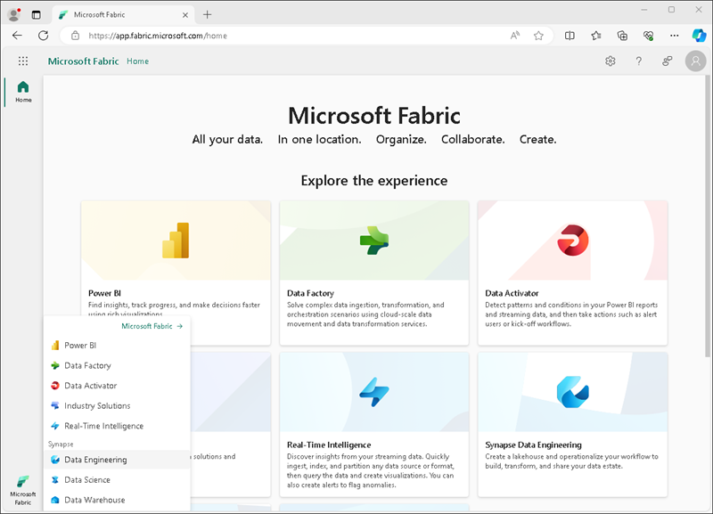

---
lab:
  title: "Exploración de análisis de datos en Microsoft\_Fabric"
  module: Explore fundamentals of large-scale data analytics
---

# Exploración de análisis de datos en Microsoft Fabric

En este ejercicio, explorará la ingesta y el análisis de datos en un almacén de lago de Microsoft Fabric.

Este laboratorio se tarda aproximadamente **25** minutos en completarse.

> **Nota**: Necesitará una licencia de Microsoft Fabric para realizar este ejercicio. Consulte [Introducción a Microsoft Fabric](https://learn.microsoft.com/fabric/get-started/fabric-trial) para obtener más información sobre cómo habilitar una licencia de evaluación de Fabric gratuita. Para hacerlo, necesitará una cuenta *profesional* o *educativa* de Microsoft. Si no tiene una, puede [registrarse para obtener una evaluación gratuita de Microsoft Office 365 E3 o superior](https://www.microsoft.com/microsoft-365/business/compare-more-office-365-for-business-plans).

## Crear un área de trabajo

Antes de trabajar con datos de Fabric, cree un área de trabajo con la evaluación gratuita de Fabric habilitada.

1. Inicie sesión en [Microsoft Fabric](https://app.fabric.microsoft.com) en `https://app.fabric.microsoft.com`.
2. En la barra de menús de la izquierda, seleccione **Áreas de trabajo** (el icono tiene un aspecto similar a &#128455;).
3. Cree una nueva área de trabajo con el nombre que prefiera y seleccione un modo de licencia en la sección **Avanzado** que incluya la capacidad de Fabric (*Prueba*, *Premium* o *Fabric*).
4. Cuando se abra la nueva área de trabajo, debe estar vacía.

    

## Creación de un almacén de lago

Ahora que tiene un área de trabajo, es el momento de cambiar a la experiencia *Ingeniería de datos* en el portal y crear un almacén de lago de datos para sus archivos de datos.

1. En la parte inferior izquierda del portal, cambie a la experiencia **Ingeniería de datos**.

    

    La página Inicio de Ingeniería de datos incluye iconos para crear recursos de ingeniería de datos que se usan habitualmente.

2. En la página Inicio de **Ingeniería de datos**, cree un nuevo **Almacén de lago** con el nombre que prefiera.

    Después de un minuto o así, se habrá creado un nuevo almacén de lago:

    

3. Vea el nuevo almacén de lago y tenga en cuenta que el panel **Explorador del almacén de lago** de la izquierda le permite examinar las tablas y los archivos del almacén de lago:
    - La carpeta **Tablas** contiene tablas que puede consultar usando SQL. Las tablas de un almacén de lago de Microsoft Fabric se basan en el formato de archivo de *Delta Lake* de código abierto, que se usa habitualmente en Apache Spark.
    - La carpeta **Archivos** contiene archivos de datos del almacenamiento OneLake para el almacén de lago que no están asociados a tablas Delta administradas. También puede crear *accesos directos* en esta carpeta para hacer referencia a datos almacenados externamente.

    Actualmente, no hay tablas ni archivos en el almacén de lago.

## Ingerir datos

Una manera sencilla de ingerir datos consiste en usar una actividad **Copiar datos** en una canalización para extraer los datos de un origen y copiarlos en un archivo del almacén de lago.

1. En la página **Inicio** del almacén de lago, en el menú **Obtener datos** seleccione **Nueva canalización de datos** y cree una canalización de datos llamada **Ingerir datos de ventas**.
1. En el Asistente para **copiar datos**, en la página **Elegir un origen de datos**, seleccione el conjunto de datos de ejemplo **Modelo de datos de minoristas de importadores de todo el mundo**.

    

1. Seleccione **Siguiente** y vea las tablas del origen de datos en la página **Conectarse al origen de datos**.
1. Seleccione la tabla **dimension_stock_item**, que contiene registros de productos. A continuación, seleccione **Siguiente** para avanzar a la página **Elegir destino de datos**.
1. En la página **Elegir destino de datos**, seleccione su almacén de lago existente. Luego, seleccione **Siguiente**.
1. Establezca las siguientes opciones de destino de datos y, luego, seleccione **Siguiente**:
    - **Carpeta raíz**: Tablas
    - **Configuración de carga**: cargar en una nueva tabla
    - **Nombre de la tabla de destino**: dimension_stock_item
    - **Asignaciones de columnas**: *deje las asignaciones predeterminadas tal cual*
    - **Habilitar partición**: *no seleccionada*
1. En la página **Revisar y guardar**, asegúrese de que la opción **Iniciar transferencia de datos inmediatamente** esté activa y, a continuación, seleccione **Guardar y ejecutar**.

    Se crea una nueva canalización que contiene una actividad **Copiar datos**, como se muestra aquí:

    

    Cuando la canalización comienza a ejecutarse, puede supervisar su estado en el panel **Salida** en el diseñador de canalizaciones. Use el icono **&#8635;** (*Actualizar*) para actualizar el estado y espere hasta que la operación se haya realizado correctamente.

1. En la barra de menús central, a la izquierda, seleccione el almacén de lago.
1. En la página **Inicio**, en el panel **Explorador de almacén de lago**, expanda **Tablas** y compruebe que se ha creado la tabla **dimension_stock_item**.

    > **Nota**: Si la nueva tabla aparece como *no identificada*, use el botón **Actualizar** de la barra de herramientas del almacén de lago para actualizar la vista.

1. Seleccione la tabla **dimension_stock_item** para ver su contenido.

    

## Consulta de datos en un almacén de lago

Ahora que ha ingerido datos en una tabla de almacén de lago, puede usar SQL para consultarlos.

1. En la parte superior derecha de la página del almacén de lago, cambie al **punto de conexión de SQL** del almacén de lago.

    

1. En la barra de herramientas, seleccione **Nueva consulta SQL**. A continuación, escriba el código SQL siguiente en el editor de consultas:

    ```sql
    SELECT Brand, COUNT(StockItemKey) AS Products
    FROM dimension_stock_item
    GROUP BY Brand
    ```

1. Seleccione el botón **&#9655; Ejecutar** para ejecutar la consulta y revisar los resultados, que deben revelar que hay dos valores de marca (*N/A* y *Northwind*) y mostrar el número de productos en cada uno.

    

## Visualización de datos en un almacén de lago

Los almacenes de lago de Microsoft Fabric organizan todas las tablas en un modelo de datos, que puede usar para crear visualizaciones e informes.

1. En la parte inferior izquierda de la página, en el panel **Explorar**, seleccione la pestaña **Modelo** para ver el modelo de datos de las tablas de un almacén de lago (en este caso solo hay una tabla).

    

1. En la barra de herramientas, seleccione **Nuevo informe** para abrir una nueva pestaña del explorador que contiene el diseñador de informes de Power BI.
1. En el diseñador de informes:
    1. En el panel **Datos**, expanda la tabla **dimension_stock_item** y seleccione los campos **Brand** y **StockItemKey**.
    1. En el panel **Visualizaciones**, seleccione la visualización **Gráfico de barras apiladas** (es la primera que aparece). A continuación, asegúrese de que el **eje Y** contiene el campo **Brand** y cambie la agregación del **eje X** a **Count** para que contenga el campo **Count of StockItemKey**. Por último, cambie el tamaño de la visualización en el lienzo del informe para rellenar el espacio disponible.

        

    > **Sugerencia**: Puede usar los iconos **>>** para ocultar los paneles del diseñador de informes con el fin de ver el informe con más claridad.

1. En el menú **Archivo**, seleccione **Guardar** para guardar el informe como **Brand Quantity Report** en el área de trabajo de Fabric.

    Ahora puede cerrar la pestaña del explorador que contiene el informe para volver a su almacén de lago. Puede encontrar el informe en la página del área de trabajo en el portal de Microsoft Fabric.

## Limpieza de recursos

Si ha terminado de explorar Microsoft Fabric, puede eliminar el área de trabajo que creó para este ejercicio.

1. En la barra de la izquierda, seleccione el icono del área de trabajo para ver todos los elementos que contiene.
2. En el menú **...** de la barra de herramientas, seleccione **Configuración del área de trabajo**.
3. En la sección **Otros**, seleccione **Quitar esta área de trabajo**.
