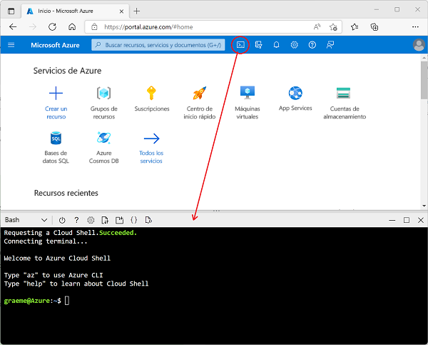

---
lab:
  title: Exploración de Azure Stream Analytics
  module: Explore data analytics in Azure
---

## Exploración de Azure Stream Analytics

En este ejercicio aprovisionará un trabajo de Azure Stream Analytics en su suscripción de Azure y lo usará para procesar un flujo de datos en tiempo real.

> <bpt id="p1">**</bpt>Note<ept id="p1">**</ept>: The exercise is part of a module on Microsoft Learn, and includes an option to use a <bpt id="p2">*</bpt>sandbox<ept id="p2">*</ept> Azure subscription. However, if you are completing this exercise as part of an instructor-led class, you should use the Azure subscription provided as part of the class instead of the sandbox.

Antes de iniciar el ejercicio en Microsoft Learn, deberá preparar un entorno de Cloud Shell para la suscripción de Azure.

1. Inicie sesión en la suscripción de Azure en [Azure Portal](https://portal.azure.com) en `https://portal.azure.com` con sus credenciales de suscripción de Azure.
2. Use the <bpt id="p1">**</bpt>[<ph id="ph1">\&gt;</ph>_]<ept id="p1">**</ept> button to the right of the search bar at the top of the page to create a new Cloud Shell in the Azure portal, selecting a <bpt id="p2">***</bpt>Bash<ept id="p2">***</ept> environment and creating storage if prompted. The cloud shell provides a command line interface in a pane at the bottom of the Azure portal, as shown here:

    

3. Note that you can resize the cloud shell by dragging the separator bar at the top of the pane, or by using the <bpt id="p1">**</bpt>&amp;#8212;<ept id="p1">**</ept>, <bpt id="p2">**</bpt>&amp;#9723;<ept id="p2">**</ept>, and <bpt id="p3">**</bpt>X<ept id="p3">**</ept> icons at the top right of the pane to minimize, maximize, and close the pane. For more information about using the Azure Cloud Shell, see the <bpt id="p1">[</bpt>Azure Cloud Shell documentation<ept id="p1">](https://docs.microsoft.com/azure/cloud-shell/overview)</ept>.

4. Ya está listo para completar el ejercicio en Microsoft Learn: solo tiene que usar Cloud Shell en su Azure Portal en lugar del se encuentra en el módulo de Learn (en blanco) (que se facilita a alumnos con una ruta de aprendizaje autodirigido mediante una suscripción de espacio aislado).

    Use el vínculo siguiente para abrir el ejercicio en Microsoft Learn.

    **[Ir a Microsoft Learn](https://docs.microsoft.com/learn/modules/explore-fundamentals-stream-processing/5-exercise-stream-analytics#create-azure-resources)**

> **Aprendizaje adicional**: Si tiene tiempo más adelante, considere la posibilidad de volver a este módulo de Microsoft Learn y probar los demás ejercicios que contiene, que incluyen explorar Spark Streaming y Azure Synapse Data Explorer.
