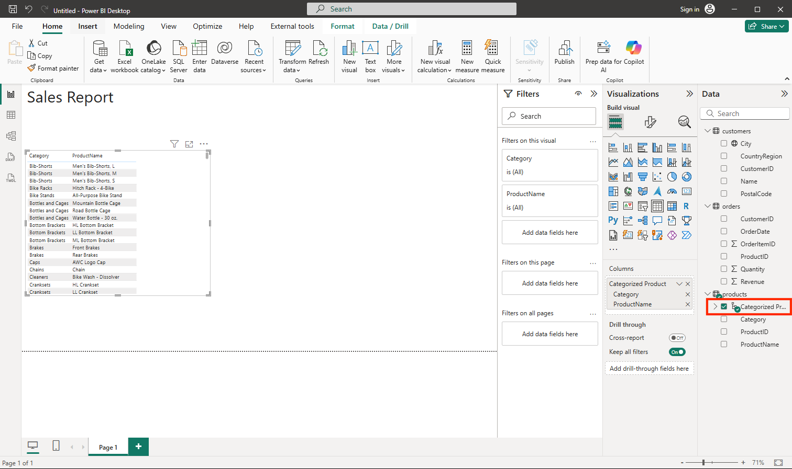

---
lab:
  title: "Exploración de los aspectos básicos de la visualización de datos con Power\_BI"
  module: Explore fundamentals of data visualization
---

# Exploración de los aspectos básicos de la visualización de datos con Power BI

En este ejercicio usará Microsoft Power BI Desktop para crear un modelo de datos y un informe que contenga visualizaciones de datos interactivas.

Este laboratorio se tarda aproximadamente **20** minutos en completarse.

## Antes de empezar

Necesitará una [suscripción de Azure](https://azure.microsoft.com/free) en la que tenga acceso de nivel administrativo.

### Instalar Power BI Desktop

Si Microsoft Power BI Desktop no está instalado aún en el equipo de Windows, puede descargarlo e instalarlo de forma gratuita.

1. Descargue el instalador de Power BI Desktop de [https://aka.ms/power-bi-desktop](https://aka.ms/power-bi-desktop?azure-portal=true).
1. Cuando el archivo se haya descargado, ábralo e instale Power BI Desktop en el equipo mediante el asistente para instalación. Esta instalación puede tardar unos minutos.

## Importar datos

1. Abra Power BI Desktop. La interfaz de la aplicación debe tener un aspecto similar al siguiente:

    

    Ahora está listo para importar los datos del informe.

1. En la pantalla de inicio de sesión de Power BI Desktop, seleccione **Obtener datos** y, a continuación, en la lista de orígenes de datos, seleccione **Web** y, a continuación, **Conectar**.

    

1. En el cuadro de diálogo **De web**, escriba la siguiente dirección URL y seleccione **Aceptar**:

    ```
    https://github.com/MicrosoftLearning/DP-900T00A-Azure-Data-Fundamentals/raw/master/power-bi/customers.csv
    ```

1. En el cuadro de diálogo Acceder a contenido web, seleccione **Conectar**.

1. Compruebe que la dirección URL abra un conjunto de datos que contiene los datos del cliente, como se muestra a continuación. A continuación, seleccione **Cargar** para cargar los datos en el modelo de datos del informe.

    

1. En la ventana principal de Power BI Desktop, en el menú Datos, seleccione **Obtener datos** y luego **Web**:

    

1. En el cuadro de diálogo **De web**, escriba la siguiente dirección URL y seleccione **Aceptar**:

    ```
    https://github.com/MicrosoftLearning/DP-900T00A-Azure-Data-Fundamentals/raw/master/power-bi/products.csv
    ```

1. En el cuadro de diálogo, seleccione **Cargar** para cargar los datos del producto de este archivo en el modelo de datos.

1. Repita los tres pasos anteriores para importar un tercer conjunto de datos que contenga datos de pedido de la siguiente dirección URL:

    ```
    https://github.com/MicrosoftLearning/DP-900T00A-Azure-Data-Fundamentals/raw/master/power-bi/orders.csv
    ```

## Exploración de un modelo de datos

Las tres tablas de datos que ha importado se han cargado en un modelo de datos, que ahora explorará y refinará.

1. En Power BI Desktop, en el borde izquierdo, seleccione la pestaña **Modelo** y, después, organice las tablas del modelo para que pueda verlas. Puede ocultar los paneles en el lado derecho mediante los iconos **>>** :

    

1. En la tabla **orders** (pedidos), seleccione el campo **Revenue** (Ingresos) y, en el panel **Propiedades**, establezca su propiedad **Formato** en **Moneda**:

    

    Este paso garantizará que los valores de ingresos se muestren como moneda en las visualizaciones de informes.

1. En la tabla products, haga clic con el botón derecho en el campo **Categoría** (o abra su menú **&vellip;** ) y seleccione **Crear jerarquía**. En este paso se crea una jerarquía denominada **Jerarquía de categoría**. Es posible que tenga que expandir o desplazarse por la tabla **products** para verlo; también puede verlo en el panel **Campos**:

    

1. En la tabla products, haga clic con el botón derecho en el campo **ProductName** (o abra su menú **&vellip;** ) y seleccione **Agregar a la jerarquía** > **Jerarquía de categoría**. Esto agrega el campo **ProductName** a la jerarquía que creó anteriormente.
1. En el panel **Campos**, haga clic con el botón derecho en **Jerarquía de categoría** (o abra su menú **...**) y seleccione **Cambiar nombre**. Luego cambie el nombre de la jerarquía a **Producto clasificado**.

    

1. En el borde izquierdo, seleccione la pestaña **Vista de datos** y, luego, en el panel **Datos**, seleccione la tabla **customers**.
1. Seleccione el encabezado de columna **Ciudad** y, a continuación, establezca su propiedad **Categoría de datos** en **Ciudad**:

    

    Este paso garantizará que los valores de esta columna se interpreten como nombres de ciudad, lo que puede ser útil si piensa incluir visualizaciones de mapa.

## Creación de un informe

Ahora ya está casi listo para crear un informe. En primer lugar, debe comprobar algunas configuraciones para asegurarse de que todas las visualizaciones están habilitadas.

1. En el menú **Archivo**, seleccione **Opciones y configuración**. A continuación, seleccione **Opciones** y, en la sección **Seguridad**, asegúrese de que **Uso de elementos visuales de mapa y mapa coroplético** esté habilitado y seleccione **Aceptar**.

    

    Esta configuración garantiza que pueda incluir visualizaciones de mapas en los informes.

1. En el borde izquierdo, seleccione la pestaña **Vista de informe** y vea la interfaz de diseño del informe.

    

1. En la cinta de opciones, encima de la superficie de diseño del informe, seleccione **Cuadro de texto** y agregue un cuadro de texto que contenga el texto **Informe de ventas** al informe. Dele al texto un formato de negrita con un tamaño de fuente de 32.

    

1. Seleccione cualquier área vacía del informe para que se deseleccione el cuadro de texto. A continuación, en el panel **Datos**, expanda **Productos** y seleccione el campo **Productos clasificados**. En este paso se agrega una tabla al informe.

    

1. Con la tabla aún seleccionada, en el panel **Datos**, expanda **Pedidos** y seleccione **Ingresos**. Se agrega una columna Ingresos a la tabla. Es posible que tenga que ampliar el tamaño de la tabla para verla.

    A los ingresos se les aplica un formato de moneda, como se especificó en el modelo. Sin embargo, no especificó el número de posiciones decimales, por lo que los valores incluyen cantidades fraccionales. Aunque no es relevante para las visualizaciones que vaya a crear, pero podría volver a la pestaña **Modelo** o **Datos** y cambiar las posiciones decimales si quiere.

    

1. Con la tabla aún seleccionada, en el panel **Visualizaciones**, seleccione la visualización **Gráfico de columnas apiladas**. La tabla se cambia a un gráfico de columnas que muestra los ingresos por categoría.

    

1. Encima del gráfico de columnas seleccionado, seleccione el icono **&#8595;** para activar la exploración en profundidad. A continuación, en el gráfico, seleccione la segunda columna para explorar en profundidad y ver los ingresos de los productos de esta categoría. Esta funcionalidad es posible porque ha definido una jerarquía de categorías y productos.

    

1. Use el icono **&#x2191;** para obtener una exploración inversa de nivel de categoría. Después, seleccione el icono **(** &#8595; **)** para desactivar la característica de exploración en profundidad.
1. Seleccione un área en blanco del informe y, luego, en el panel **Datos**, elija el campo **Cantidad** en la tabla **orders** y el campo **Categoría** en la tabla **products**. En este paso se genera otro gráfico de columnas en el que se muestra la cantidad de ventas por categoría de producto.
1. Con el nuevo gráfico de columnas seleccionado, en el panel **Visualizaciones**, seleccione **Gráfico circular** y, a continuación, cambie el tamaño del gráfico y colóquelo junto al gráfico de columnas de ingresos por categoría.

    

1. Seleccione un área en blanco del informe y, luego, en el panel **Datos**, seleccione el campo **Ciudad** en la tabla **customers** y, luego, seleccione el campo **Ingresos** en la tabla **orders**. Esto da como resultado un mapa en el que se muestran los ingresos por ventas por ciudad. Reorganice y cambie el tamaño de las visualizaciones cuando sea necesario:

    

1. En el mapa, tenga en cuenta que, para interactuar, puede arrastrar, hacer doble clic, usar la rueda del mouse o acercar y arrastrar en una pantalla táctil. A continuación, seleccione una ciudad específica y tenga en cuenta que las demás visualizaciones del informe se modifican para resaltar los datos de la ciudad seleccionada.

    

1. En el menú **Archivo**, seleccione **Guardar**. A continuación, guarde el archivo con un nombre de archivo .pbix adecuado. Puede abrir el archivo y seguir explorando el modelado y la visualización de los datos a su antojo.

Si tiene una suscripción a un [servicio Power BI](https://www.powerbi.com/?azure-portal=true), puede iniciar sesión en su cuenta y publicar el informe en un área de trabajo de Power BI. 
